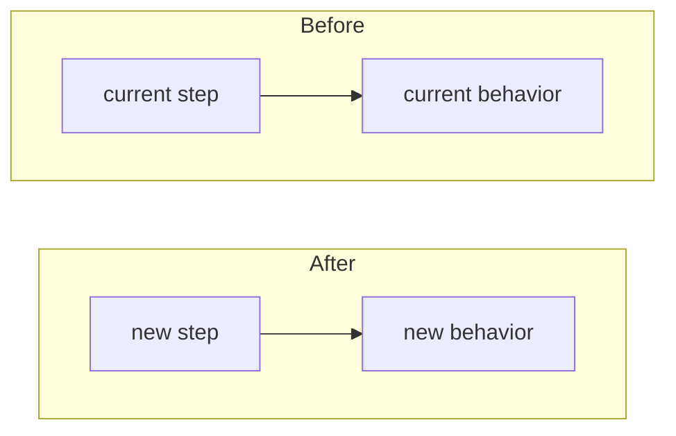
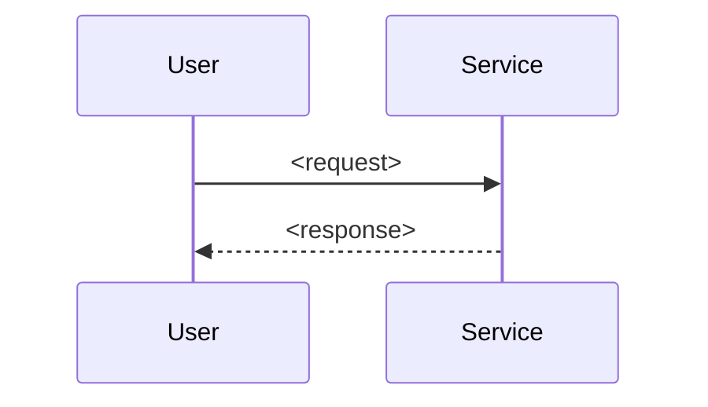

# NEXT TODO Template

Use these skeletons for new-format plans.

Rules: H1/H2/H3 only, no bold, no emojis. Do not create `watchtower/NEXT.VERIFY.md` for new plans. File refs in prose, lists, and tables must be markdown links.

## File Tree

```text
next/
  NEXT.md
  CONTEXT.md
  todos/
    TODO-001-short-title.md
    TODO-002-short-title.md
  archive/
    <slug>/
      NEXT.md
      CONTEXT.md
      todos/
```

## watchtower/NEXT.md

```markdown
# NEXT

## Current Active Plan

- Title: <plan title>
- Slug: <YYYYMMDD-kebab-title> (assigned once at create; archive step reuses it)
- Status: <ACTIVE | DONE | ARCHIVED>
- Updated: <YYYY-MM-DD>

## Tracker

One row per TODO. Group ties together items that ship as one transaction.

| Order | TODO | Group | Status | Spec | Deps | Context | Notes |
|-------|------|-------|--------|------|------|---------|-------|
| 1 | TODO-001 <short title> | A | TODO | [watchtower/todos/TODO-001-short-title.md](watchtower/todos/TODO-001-short-title.md) | - | [watchtower/CONTEXT.md](watchtower/CONTEXT.md) | <one-line note> |
| 2 | TODO-002 <short title> | A | TODO | [watchtower/todos/TODO-002-short-title.md](watchtower/todos/TODO-002-short-title.md) | TODO-001 | [watchtower/CONTEXT.md](watchtower/CONTEXT.md) | Read TODO-001 Outcome first. |
| 3 | TODO-003 <short title> | standalone | TODO | [watchtower/todos/TODO-003-short-title.md](watchtower/todos/TODO-003-short-title.md) | - | - | <one-line note> |

TODO Status labels: TODO, IN PROGRESS, BLOCKED, DONE.
Plan-level Status header: ACTIVE while any row is open, DONE when all rows DONE, ARCHIVED after archive.

## Plan Verify

- <command or cross-TODO check that proves full plan works>

## Handoff

- Next action: <single next step fresh session should take>

## Archive

- None.
```

## watchtower/CONTEXT.md

```markdown
# Plan Context

## Shared Context

- <short fact that applies across TODOs>
- <constraint, command, or project rule used by more than one TODO>

## Decisions

- <decision already made>

## Open Decisions

- None.

## References

- [<path>](<path>) or `<command>`
```

## watchtower/todos/TODO-001-short-title.md

````markdown
# TODO-001 <title>

Group: A (<why these items are grouped, or standalone>)

## Brief

Goal: <outcome in one or two sentences>.

Logic (before -> after):



How:

- <step 1>
- <step 2>

Files:

- [<path>](<path>) (<what changes here>)
- [<path>](<path>) (<what changes here>)

Expected result:

- <observable outcome that proves done>
- <observable outcome that proves done>

Prompt:

```text
<exact prompt to hand implementer or agent for this TODO; if a skill fits, name it, e.g. "Use /solve to ...">
```

## Verify

- <command or manual check> -> <expected result>
- <command or manual check> -> <expected result>

## Outcome

Status: TODO
````

## TODO Outcome When Done

```markdown
## Outcome

Status: DONE

Changed:
- <what changed>

Contract:
- <behavior or interface preserved/created>

Verified:
- <command/check> -> <real result>
```

## Alternate TODO Chart Example

Use one chart per TODO when it helps. For doc-only or single-line TODOs, use one-line `Change:` note instead.


