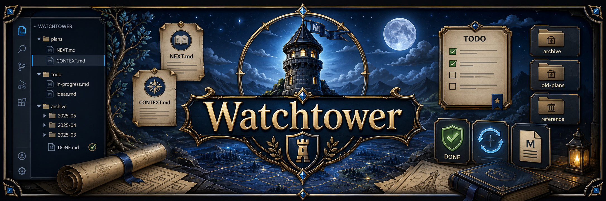

# Watchtower



[](https://github.com/HiepPP/watchtower)
[](https://code.visualstudio.com/)
[](https://www.typescriptlang.org/)
[](#license)

A VS Code sidebar that stands guard over your `watchtower/` plan files and reports back, without ever laying a finger on them.

Think of it as a loyal sentry on the wall. It tallies your progress, flags the TODOs rotting in the dungeon, digs up old plans from the archive, and hands you copy-ready commands. It only ever looks. Your Markdown sleeps safe.

<!-- Demo: replace with a screenshot or GIF of the Watchtower sidebar in action. -->

## Table of Contents

- [Features](#features)
- [The Problem](#the-problem)
- [Why Watchtower](#why-watchtower)
- [Requirements](#requirements)
- [Install](#install)
- [Usage](#usage)
- [Using The /watchtower Skill](#using-the-watchtower-skill)
- [Expected Plan Layout](#expected-plan-layout)
- [Commands](#commands)
- [Architecture](#architecture)
- [Develop](#develop)
- [Build and Package](#build-and-package)
- [Contributing](#contributing)
- [License](#license)

## Features

- Shows a dashboard with progress, status counts, TODO sections, and archive rows.
- Groups TODOs by Active, Blocked, Todo, and Done.
- Shows a blocked summary when any TODO is stuck.
- Opens `NEXT.md`, `CONTEXT.md`, TODO specs, and archived plans.
- Copies `$watchtower` and `/watchtower` commands from the sidebar.
- Opens Markdown files in rendered preview by default.
- Refreshes on its own when any file under `watchtower/` changes.
- Read-only by design. It never writes to your plan files.

## The Problem

You rarely work on one task. You work on a stack of them. The hard part is not the work itself. It is keeping the stack straight.

- Too many tasks at once. Several are in flight, a few are blocked, and you start the wrong one because you lost track of which was which.
- Work that was never defined. A task just says "fix billing". When you open it, you no longer remember what "fix" meant, so you re-think it from scratch.
- A cold return. You step away for a day. When you come back, the thread is gone: what got done, what is next, and why something stalled.

Each of these costs you the same thing - time spent rebuilding context instead of shipping.

## Why Watchtower

The `/watchtower` skill keeps every plan as plain Markdown in a `watchtower/` directory. That is easy to edit but hard to scan, and it does nothing to hold your context when you walk away. Watchtower turns the directory into a live dashboard, so the stack stays straight.

| Pain point | What it costs you | How Watchtower solves it |
|---|---|---|
| Too many tasks at once | You lose track of what is active, blocked, or done | The dashboard groups TODOs by Active, Blocked, Todo, and Done, with progress and status counts at a glance |
| Work that was never defined | You re-think the task every time you open it | Each TODO is a spec file with Brief, Verify, and Outcome. One click opens it in rendered preview, so the definition is always in front of you |
| A cold return | You waste the first hour back rebuilding context | `NEXT.md` is the single source of truth. The blocked summary shows why work stalled, the archive keeps past plans, and the view refreshes itself, so it is current the moment you open it |

The result: open the sidebar and you see exactly where you left off, what is defined, and what to pick up next.

## Requirements

- Visual Studio Code 1.85.0 or newer.
- A workspace that contains a `watchtower/NEXT.md` file. The extension only activates when this file is present.

## Install

Install from a packaged VSIX:

```bash
git clone https://github.com/HiepPP/watchtower.git
cd watchtower
npm install
npm run package
code --install-extension watchtower-0.1.0.vsix
```

Once installed, the Watchtower icon appears in the Activity Bar of any workspace that contains a `watchtower/NEXT.md` file.

## Usage

1. Open a workspace that has a `watchtower/NEXT.md` file.
2. Click the Watchtower icon in the Activity Bar.
3. The Dashboard view shows plan progress, file actions, commands, TODOs, and archive rows.

What each area does:

- Plan card: opens `watchtower/NEXT.md`.
- File actions: open `NEXT.md` and `CONTEXT.md`.
- Command groups: copy `$watchtower` or `/watchtower` commands.
- TODO rows: preview each TODO spec file.
- Archive rows: preview archived `NEXT.md` files.

If the active plan is missing, the dashboard shows `No active plan`.

## Using The /watchtower Skill

`/watchtower` creates and updates the plan files that this extension reads.
The skill writes Markdown. The VS Code extension only displays it.

| Task | Command | Result |
|---|---|---|
| Create a plan | `/watchtower new <summary>` | Creates `watchtower/NEXT.md`, `watchtower/CONTEXT.md`, and TODO specs |
| Ask what to do next | `/watchtower next` or `what next?` | Reads the Tracker and proposes the next TODO |
| Update status | `/watchtower progress <summary>` | Updates Tracker status and TODO Outcome notes |
| Run checks | `/watchtower verify` | Runs TODO checks and marks passing TODOs as `DONE` |
| Build work | `/watchtower implement` | Builds the current TODO and records the real result |
| Build with agents | `/watchtower implement team` | Splits safe work across subagents, then shuts them down |
| Archive a plan | `/watchtower archive` | Moves the active plan into `watchtower/archive/<slug>/` |

Common flow:

```bash
/watchtower new add billing settings cleanup
/watchtower next
/watchtower implement
/watchtower verify
/watchtower archive
```

Use `--repo <path>` when your shell is not already inside the target repo:

```bash
/watchtower next --repo /path/to/project
```

The skill keeps active work in `watchtower/NEXT.md`.
It writes TODO details under `watchtower/todos/`.
It moves finished plans into `watchtower/archive/`.

## Expected Plan Layout

The extension reads a fixed layout inside the `watchtower/` directory.

```text
watchtower/
  NEXT.md                 # active plan: header block + Tracker table
  todos/
    TODO-001-...md        # spec files with Brief / Verify / Outcome
  archive/
    20260620-some-slug/
      NEXT.md             # an archived plan
```

`NEXT.md` needs a `## Current Active Plan` header block and a `## Tracker` table:

```markdown
## Current Active Plan

Title: Gacha Size Quiz
Slug: 20260620-gacha-size-quiz
Status: ACTIVE
Updated: 2026-06-21

## Tracker

| Order | TODO | Group | Status | Spec | Deps | Context | Notes |
|---|---|---|---|---|---|---|---|
| 1 | TODO-001 Build the shell | standalone | DONE | watchtower/todos/TODO-001-build-the-shell.md | - | CONTEXT.md | Done. |
```

Notes on parsing:

- The Tracker header must contain the columns `Order`, `TODO`, and `Status`.
- The Spec cell may be a plain path or a Markdown link. Only the file name is used, resolved against `watchtower/todos/`.
- A spec file may end with an `## Outcome` section that carries a `Status:` line. That status wins over the Tracker status.
- The extension ignores any `NEXT.md` at the repo root. It reads the `watchtower/` directory only.

## Commands

| Command | Title | Where |
|---|---|---|
| `watchtower.refresh` | Watchtower: Refresh Plan | Refresh icon in the view title bar |
| `watchtower.openNext` | Watchtower: Open NEXT.md | Command Palette |

Dashboard clicks open Markdown files in the rendered preview by default.

The view also refreshes on its own when files under `watchtower/` change, so manual refresh is rarely needed.

## Architecture

The extension activates on a workspace that contains `watchtower/NEXT.md`, builds a webview dashboard, and re-reads the plan whenever `watchtower/` changes.

```text
VS Code activates (workspaceContains:watchtower/NEXT.md)
  |
  v
activate()  -->  findRootDir()
  |
  v
WatchtowerDashboardProvider  -->  readPlan(watchtower/NEXT.md)
  |                            |
  |                            v
  |                       renderDashboardHtml()
  |                            |
  v                            v
Webview dashboard  <-->  postMessage open/copy/refresh
  ^
  |
File watcher on watchtower/**  -->  provider.refresh()
```

| File | Responsibility |
|---|---|
| `src/extension.ts` | Activation, root folder resolution, commands, file watcher |
| `src/parser.ts` | Reads and parses `NEXT.md` and spec files, lists the archive |
| `src/model.ts` | Types and status mapping for plans and TODOs |
| `src/dashboardProvider.ts` | Webview provider, file actions, copy actions, refresh |
| `src/dashboardHtml.ts` | Pure HTML renderer for dashboard state |
| `media/dashboard.css` | VS Code themed dashboard styles |
| `media/dashboard.js` | Webview click handling, collapse state, toast |

## Develop

```bash
npm install
npm run compile
npm test
```

Press F5 from the project folder to launch the Extension Development Host. Open a workspace with a `watchtower/NEXT.md` file to see the dashboard.

Use watch mode to rebuild on save:

```bash
npm run watch
```

## Build and Package

```bash
npm run package
```

This type-checks, bundles with esbuild, and produces `watchtower-0.1.0.vsix`. Install it with:

```bash
code --install-extension watchtower-0.1.0.vsix
```

## Contributing

Contributions are welcome.

1. Fork the repository and create a branch.
2. Make your change and add or update tests under `test/`.
3. Run `npm run compile` and `npm test` to confirm everything passes.
4. Open a pull request describing the change.

## License

Released under the MIT License.

[Back to top](#watchtower)
