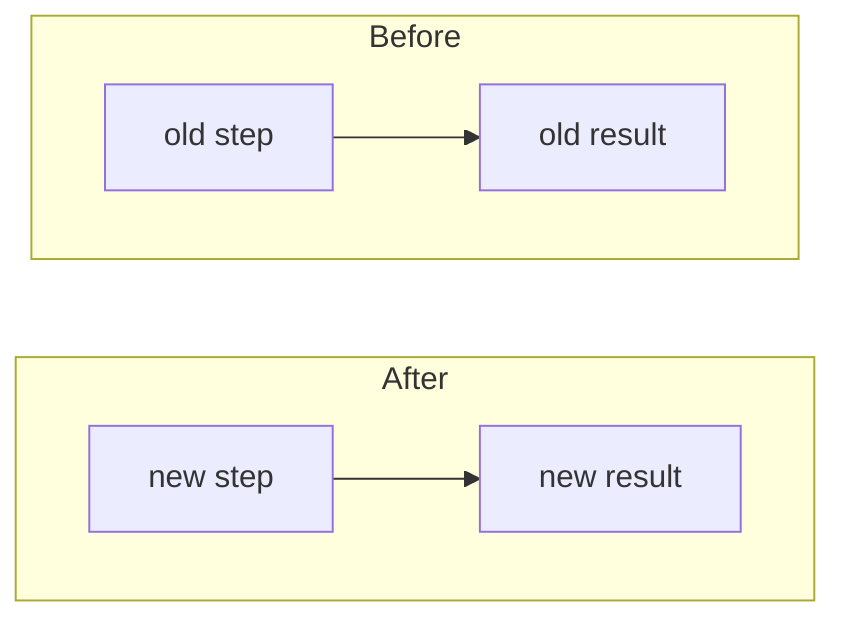
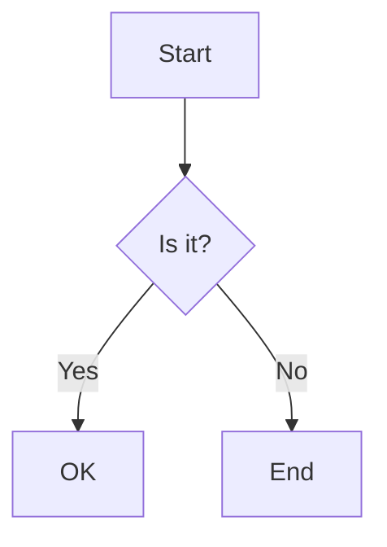
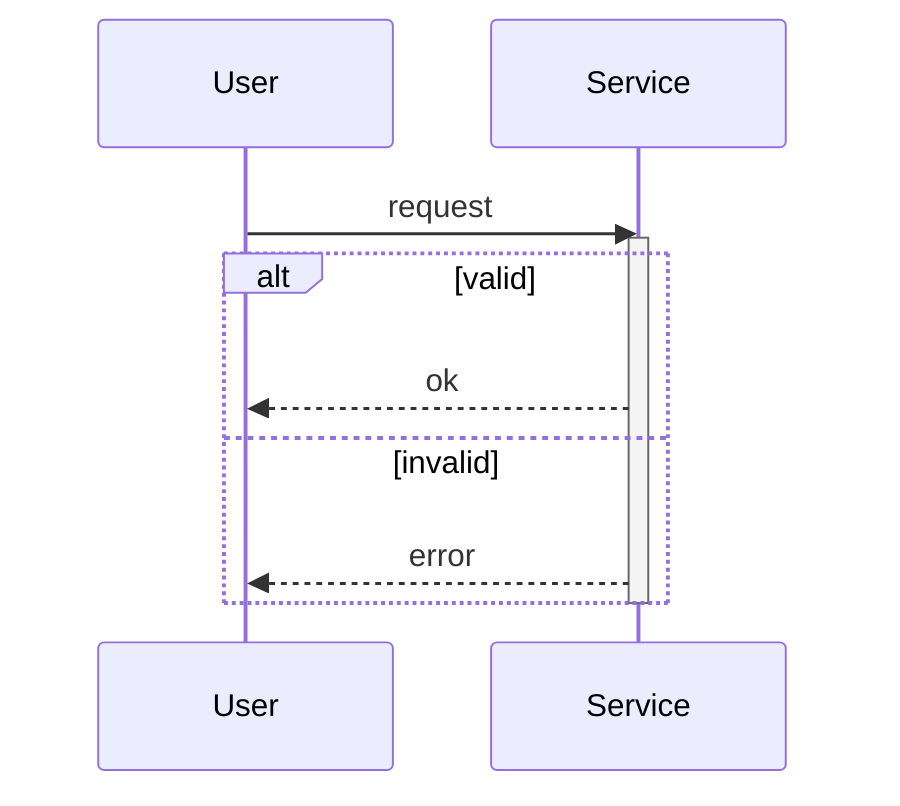
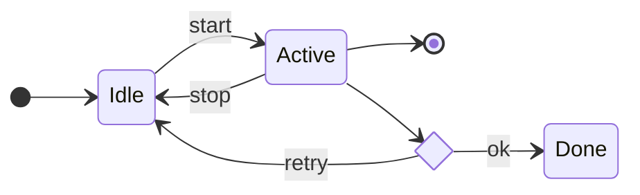
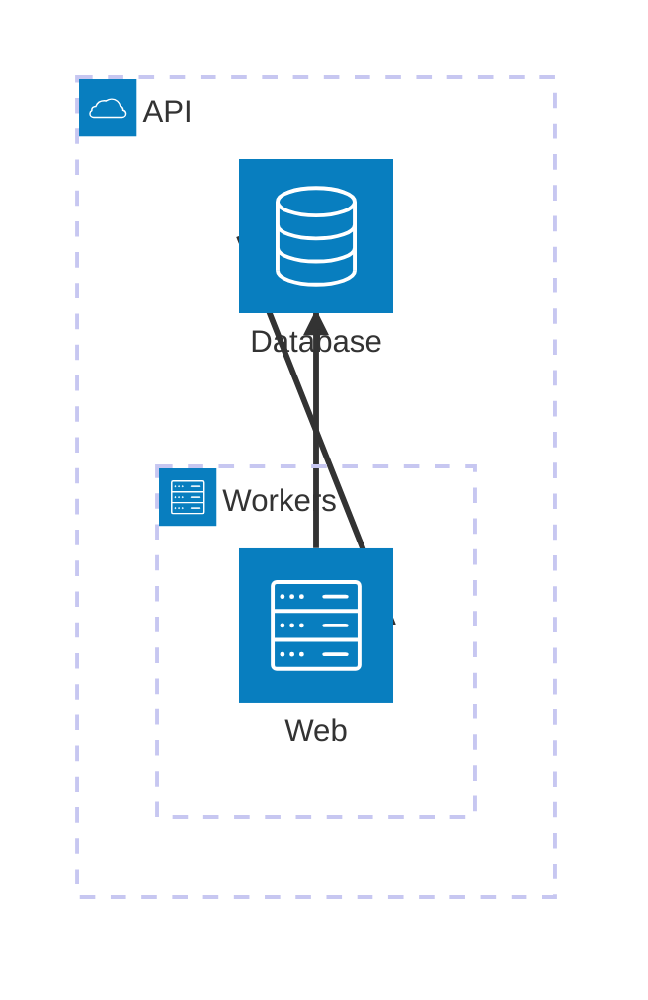
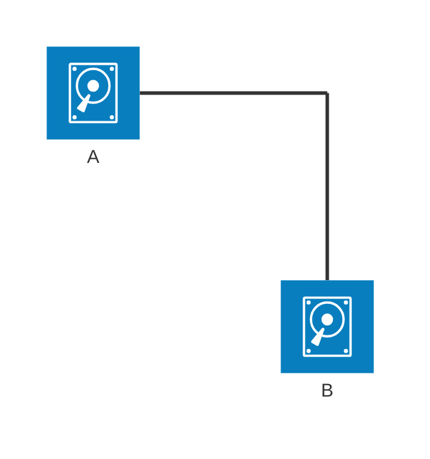

# Mermaid Chart Reference

Pick one chart type per TASK - the one that best shows that TASK's logic or change.
Keep the chart small. Keep node and edge labels exact (real identifiers from the code).

## Flowchart - branching logic or a before/after change

Before/after change (the default when a TASK changes a flow):

Plain branching:

Direction: TB, TD, BT, RL, LR. Common shapes: `[rect]`, `(round)`, `([stadium])`,
`[(db)]`, `((circle))`, `{decision}`, `{{hex}}`, `[/io/]`. Edges: `-->`, `---`,
`-.->`, `==>`, `-->|text|`, `~~~` (invisible).

## Sequence diagram - calls between parts over time

Arrows: `->>` solid, `-->>` dotted reply, `-)` async, `-x` lost. Also: `loop`, `opt`,
`par`, `critical`, `break`, `note right of X`, `box` (group), `rect` (highlight),
`autonumber`.

## State diagram - states and the transitions between them

Also: composite states `state X { ... }`, fork/join `<<fork>>` and `<<join>>`,
concurrency with `--`, and `note right of X`.

## Architecture diagram - how services or modules connect (mermaid v11.1.0+)

Default icons: cloud, database, disk, internet, server. Ports: L, R, T, B. Add `<` or
`>` for arrows. Custom icons: register an iconify pack, then `name:icon`.

Groups, nested groups, services, edges:

Junction (a 4-way split point):

Also: an edge out of a group uses the `{group}` modifier on a service
(`s1{group}:R --> L:s2{group}`), never on a group id. `align column a b` or
`align row a b` stops siblings from overlapping.

## Gotchas

- Lowercase `end` as a flowchart node id breaks the chart. Capitalize it (`End`) or wrap it (`[end]`).
- A flowchart node id starting with `o` or `x` right after a link (`A---oB`) makes a circle/cross edge by accident. Add a space or capitalize.
- In a sequence diagram the word `end` inside a message can break it; wrap it as `(end)`.
- Hex colors are not supported in sequence `box`/`rect` (the `#` reads as a comment). Use `rgb(...)` or `rgba(...)`.
- `architecture-beta` needs a mermaid v11.1.0+ renderer, or it shows nothing. Drop architecture charts when renderer is older.
- Architecture `{group}` works only on a service inside a group, never on a group id.
- Wrap labels that contain special characters in double quotes: `id1["This (text)"]`.
