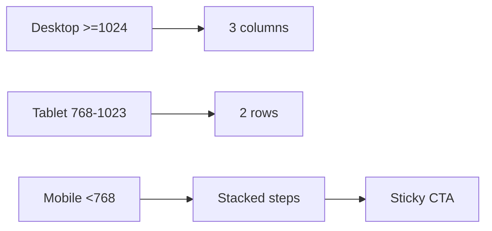

# TODO-004 Integrate Responsive Flow And QA

Group: standalone

## Brief

Goal: Wire final section into target surface and verify desktop, tablet, mobile, interaction states, and build.

Logic:



How:

- Target page already mounts quiz at `app/src/pages/index.astro` section `#mini-quiz`.
- Desktop: input cards, gacha visual, result panel in three columns.
- Tablet: input cards full width or two-row layout, machine plus result stay visible.
- Mobile: machine preview, steps stacked, sticky CTA.
- Small mobile below 480px: use CSS fallback chamber.
- Add interaction states: idle, selecting, revealing, result ready.
- Keep keyboard focus order logical.
- Keep button text on one line.
- Keep no overlap across breakpoints.
- Run plan verify checks.

Files:

- `app/src/components/react/ProductQuiz.tsx`: responsive styles and state polish.
- `app/src/pages/index.astro`: keep section mount and adjust surrounding shell only if needed.
- `app/src/components/react/GachaCapsuleChamber.tsx`: final breakpoint guard only if TODO-003 added it.

Expected result:

- Section is usable on desktop, tablet, mobile.
- Mobile CTA is reachable.
- Result remains readable after reveal.
- Build passes.
- Affiliate links and homepage anchors still work.

Prompt:

```text
Use chrome-devtools-mcp:chrome-devtools. Implement TODO-004 only. Finalize existing homepage ProductQuiz responsive flow. Match responsive behavior from annotated responsive spec. Desktop uses 3 zones. Tablet uses 2 rows. Mobile stacks steps with sticky CTA. Verify no text overlap, affiliate links still work, and no canvas dependency for core UX.
```

## Verify

- `git diff --check` -> no whitespace errors.
- `pnpm check` -> no type or Astro errors.
- `pnpm build` -> static build passes.
- `pnpm audit:launch` -> launch audit passes.
- Manual desktop check >=1024 -> three zones visible and aligned.
- Manual tablet check 768-1023 -> layout becomes two-row without overlap.
- Manual mobile check <768 -> stacked flow and sticky CTA work.
- Manual small mobile check <480 -> CSS fallback chamber works.
- Manual keyboard check -> controls and CTA reachable in order.
- Screenshot check -> desktop and mobile evidence saved under `.playwright-mcp/`.

## Outcome

Status: BLOCKED

Reverify 2026-06-20:
- Visual PASS. Desktop, tablet, mobile, and small mobile now match target direction much closer.
- Desktop shows input cards, red gacha machine, and result panel as 3 zones.
- Tablet shows input cards first, then machine and result as second row.
- Mobile stacks machine, input cards, result panel.
- Mobile sticky CTA exists.

Passed:
- `git diff --check` -> clean.
- `pnpm check` -> 0 errors.
- `pnpm build` -> 87 pages.
- Result click shows affiliate CTA.
- Affiliate CTA `rel="sponsored nofollow noopener noreferrer"` present after click.
- Console check -> 0 errors, 0 warnings during screenshot run.
- Manual mobile check -> sticky CTA present.
- Screenshot check -> evidence saved.

Failed:
- `pnpm audit:launch` -> exit 1. Product JSON still has root Shopee URL placeholders. Existing content gate, not quiz-specific.

Evidence:
- `.playwright-mcp/gacha-image-to-code-desktop-1440-final.png`
- `.playwright-mcp/gacha-image-to-code-tablet-900-final.png`
- `.playwright-mcp/gacha-image-to-code-mobile-390-final.png`
- `.playwright-mcp/gacha-fix-small-375.png`
- `.playwright-mcp/gacha-fix-result-clicked-desktop.png`

Blocked:
- Audit gate needs product affiliate URL cleanup or separate explicit exception.
