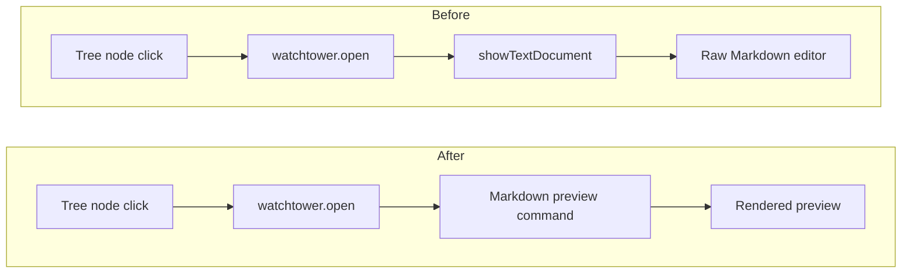

# TODO-001 Default Clicks Show Markdown Preview

Group: standalone

## Brief

Goal: Watchtower tree clicks open rendered Markdown preview by default. Raw Markdown editor no longer opens on normal plan, TODO, spec, section, or archive clicks.

Logic (before -> after):



How:

- Update [src/extension.ts](src/extension.ts) so default `watchtower.open` opens Markdown preview for Markdown files.
- Preserve safe raw-source fallback for failed preview or non-Markdown path if needed.
- Keep [src/tree.ts](src/tree.ts) command wiring scoped to Watchtower nodes.
- Update [README.md](README.md) usage text so click behavior says preview, not raw source.
- Run compile, tests, and manual Extension Development Host click check.

Files:

- [src/extension.ts](src/extension.ts) (change default open command behavior)
- [src/tree.ts](src/tree.ts) (adjust tree command args only if needed)
- [README.md](README.md) (document preview-first click behavior)

Expected result:

- Clicking plan, TODO, spec, section, or archive nodes opens rendered Markdown preview by default.
- Raw Markdown source editor does not open on normal tree click.
- Refresh and parsing behavior stay unchanged.

Prompt:

```text
Implement TODO-001 in /Users/hiep/Projects/watchtower. Change Watchtower VS Code tree clicks so Markdown files open rendered Markdown preview by default, not raw Markdown source. Read src/extension.ts and src/tree.ts before editing. Keep scope small. Preserve refresh, parser, archive, and status behavior. Update README click wording. Verify with npm run compile, npm test, and a manual Extension Development Host check if available.
```

## Verify

- `npm run compile` -> TypeScript and bundle pass.
- `npm test` -> Parser tests pass.
- Manual VS Code Extension Development Host check -> clicking Watchtower plan, TODO, spec, section, and archive nodes opens rendered Markdown preview by default.

## Outcome

Status: DONE

Progress:
- `openFileAtLine` impact LOW: 1 direct caller, 0 processes.
- `openCommand` impact HIGH: plan, TODO, spec, section, and archive nodes affected. Screenshot proved this is needed blast radius.

Changed:
- [src/tree.ts](src/tree.ts) routes Markdown tree commands straight to `markdown.showPreview`.
- [src/extension.ts](src/extension.ts) routes `.md` paths through `markdown.showPreview`.
- [src/extension.ts](src/extension.ts) keeps raw editor fallback through `openTextAtLine`.
- [README.md](README.md) says tree clicks preview Markdown.

Contract:
- Tree command still covers plan, TODO, spec, section, and archive nodes.
- Parser, refresh, archive, and status behavior unchanged.

Verified:
- `npm run compile` -> passed; bundle contains `markdown.showPreview`.
- `npm test` -> passed; 8 tests passed.
- `git diff --check` -> passed.
- `npx gitnexus detect-changes --repo watchtower --scope all` -> medium risk; 1 affected process: `GetChildren -> OpenCommand`.
- `code --uninstall-extension local.watchtower` -> uninstalled current extension.
- `npm run package` -> built [watchtower-0.1.0.vsix](watchtower-0.1.0.vsix).
- `code --install-extension watchtower-0.1.0.vsix --force` -> installed `local.watchtower@0.1.0`.

Blocked:
- None.

Confirmed:
- User confirmed click opens Markdown preview after rebuild and install.
