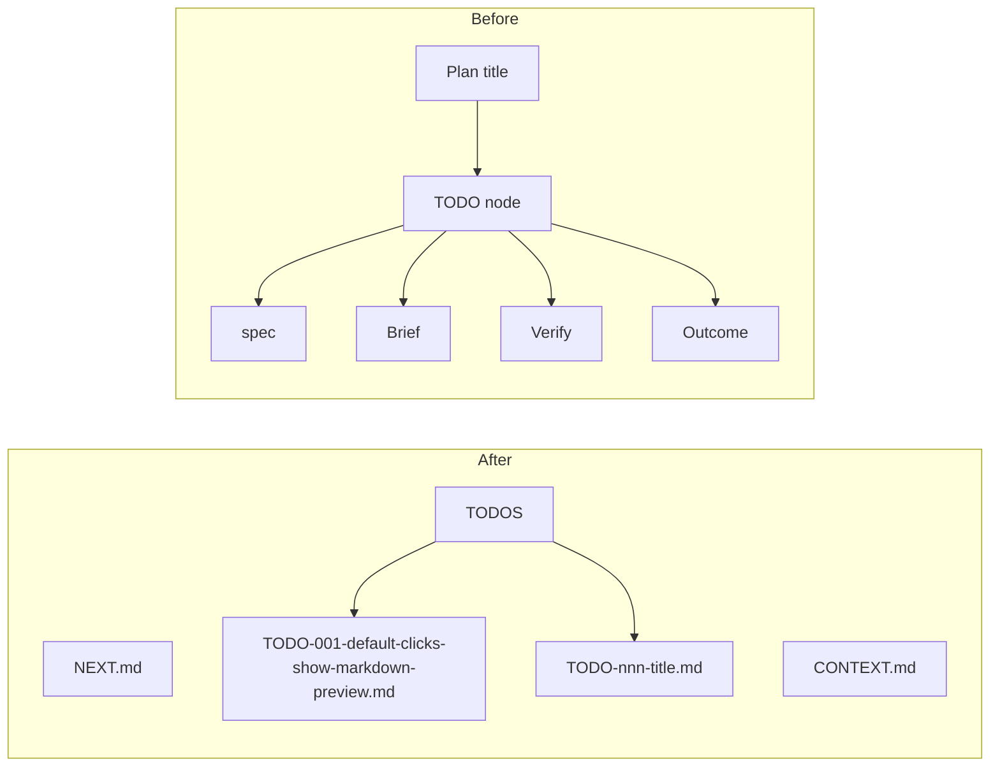

# TODO-002 Show Simple File Tree UI

Group: standalone

## Brief

Goal: Watchtower view shows real plan file layout. Tree stays simple: `NEXT.md`, `CONTEXT.md`, `TODOS`, then TODO files.

Logic (before -> after):



How:

- Update [src/tree.ts](src/tree.ts) so root nodes mirror `watchtower/` files.
- Show `NEXT.md` and `CONTEXT.md` as file nodes when present.
- Show `TODOS` folder node with one child per Tracker TODO.
- Keep Markdown preview click behavior from TODO-001.
- Do not show section nodes, plan status root, or archive node in this simple UI.

Files:

- [src/tree.ts](src/tree.ts) (tree node shape)
- [README.md](README.md) (usage text if needed)

Expected result:

- Watchtower tree root shows `NEXT.md`, `CONTEXT.md`, and `TODOS`.
- `TODOS` expands to full TODO filenames, not shortened TODO ids.
- Clicking each Markdown node opens rendered preview.

Prompt:

```text
Implement TODO-002 in /Users/hiep/Projects/watchtower. Change Watchtower sidebar to show a simple file tree: NEXT.md, CONTEXT.md, TODOS, then TODO file nodes using full source filenames like TODO-001-default-clicks-show-markdown-preview.md. Keep preview-click behavior. Remove section child nodes and plan-title root UI from the tree. Verify with npm run compile, npm test, and manual VS Code repo window check after packaging/installing.
```

## Verify

- `npm run compile` -> TypeScript and bundle pass.
- `npm test` -> Parser tests pass.
- Manual VS Code repo window check -> root tree shows `NEXT.md`, `CONTEXT.md`, `TODOS`; `TODOS` shows TODO file nodes; clicks open preview.

## Outcome

Status: BLOCKED

Progress:
- Impact LOW for `WatchtowerTreeProvider`, `rootNodes`, `getChildren`, `todoNodes`, `todoChildren`, `archiveNodes`, `todoIcon`, and `planIcon`.

Changed:
- [src/tree.ts](src/tree.ts) now renders `NEXT.md`, `CONTEXT.md`, and `TODOS`.
- [src/tree.ts](src/tree.ts) shows TODO files under `TODOS` by full source filename.
- [src/tree.ts](src/tree.ts) uses `path.basename(todo.specPath)` for TODO labels.
- [README.md](README.md) now documents simple tree UI.
- [.vscodeignore](.vscodeignore) now excludes generated plan and GitNexus files from VSIX package.

Contract:
- Markdown node clicks still open rendered preview.
- Extension stays read-only.
- Parser and watcher behavior unchanged.

Verified:
- `npm run compile` -> passed.
- `npm test` -> passed; 8 tests passed.
- `npm run package` -> passed; VSIX contains 6 files only.
- `code --install-extension watchtower-0.1.0.vsix --force` -> installed `local.watchtower@0.1.0`.
- `code --list-extensions --show-versions | rg -n "^local\\.watchtower@"` -> `local.watchtower@0.1.0`.
- `rg -n "path\\.basename\\(todo\\.specPath\\)|new WatchtowerNode\\(\"todo\", fileName" src/tree.ts dist/extension.js` -> source and bundle use full filename label.
- `git diff --check` -> passed.
- `npx gitnexus detect-changes --repo watchtower --scope all` -> HIGH risk; 14 affected tree/parser display flows due `rootNodes/getChildren` UI rewrite.

Blocked:
- Manual VS Code repo-window proof not run after install. Reload window needed first.
