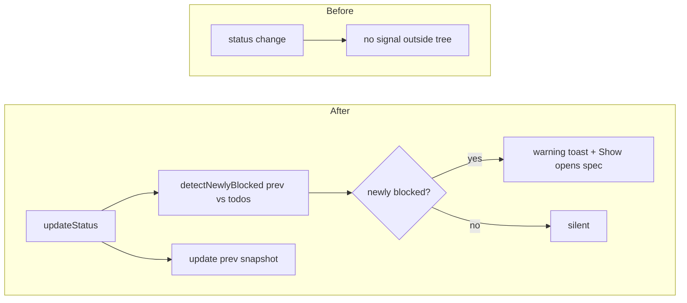

# TASK-004 Blocked notifications

Group: ext (edits src/extension.ts; ships with TASK-003)

## Brief

Goal: fire one warning toast when a TODO flips to BLOCKED. Quiet on first load and on every other status change.

Logic (before -> after):



How:

- Import `detectNewlyBlocked` from [src/status.ts](src/status.ts).
- Hold a module-level `prevStatus = new Map<string, TodoStatus>()` snapshot in [src/extension.ts](src/extension.ts).
- In `updateStatus()` (from TASK-003), after reading the plan: call `detectNewlyBlocked(prevStatus, plan.todos)`.
  - For each returned id, `vscode.window.showWarningMessage(`Watchtower: ${id} is BLOCKED`, "Show")`; on "Show", open that todo `specPath` via existing `openFileAtLine`.
  - Then rebuild `prevStatus` from current `plan.todos` (id -> status).
- First load: prevStatus empty, so detectNewlyBlocked returns empty, no toast; snapshot still seeded.
- No setting added. Always on.

Files:

- [src/extension.ts](src/extension.ts) (prevStatus snapshot, blocked diff toast inside updateStatus)

Expected result:

- First activation never toasts, even with BLOCKED rows already present.
- Changing a TODO from TODO/IN_PROGRESS/DONE to BLOCKED fires exactly one warning toast.
- "Show" opens that TODO spec file.
- Re-saving with the same BLOCKED status does not re-toast.

Prompt:

```text
Edit src/extension.ts. Run impact analysis on updateStatus and activate first. Add a module-level prevStatus Map. Inside updateStatus (from TASK-003), call detectNewlyBlocked(prevStatus, plan.todos); for each id show a warning toast with a Show action that opens the spec via openFileAtLine; then rebuild prevStatus from plan.todos. Ensure first load seeds the snapshot without toasting. Run npm run compile.
```

## Verify

- `npm run compile` -> no type error.
- F5 dev host, open workspace where a TODO is already BLOCKED -> no toast on activate.
- Change a Tracker Status to BLOCKED and save -> one warning toast appears; "Show" opens that TODO spec.
- Save again unchanged -> no second toast.
