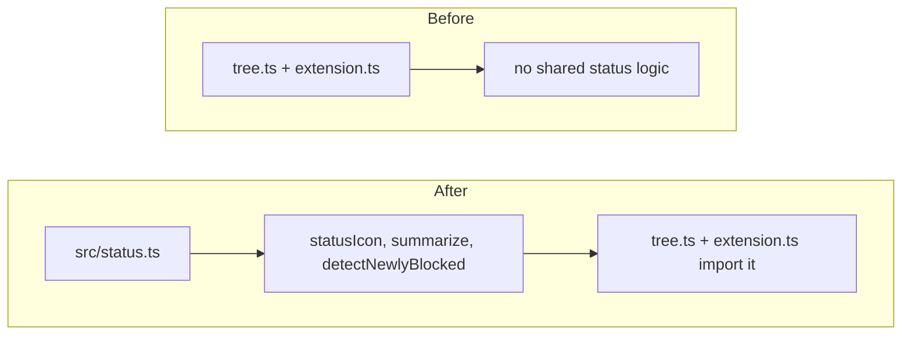

# TODO-001 Status mapping module

Group: standalone (pure module; foundation other TODOs import)

## Brief

Goal: add pure `src/status.ts` that maps a `TodoStatus` to icon+color, summarizes plan counts, and detects newly-blocked TODOs. No VS Code UI wiring here, only pure functions plus a thin `ThemeIcon` builder.

Logic (before -> after):



How:

- Add `STATUS_ICON` map: status -> { icon, color } using decided values in [watchtower/CONTEXT.md](watchtower/CONTEXT.md).
- Export `statusIcon(status: TodoStatus): vscode.ThemeIcon` building `new vscode.ThemeIcon(icon, color ? new vscode.ThemeColor(color) : undefined)`.
- Export `summarize(plan: Plan)` returning `{ done, total, remaining, inProgressId, blockedIds }`. `inProgressId` = lowest-order IN_PROGRESS todo id or null. `blockedIds` = ids with status BLOCKED.
- Export `detectNewlyBlocked(prev: Map<string, TodoStatus>, todos: Todo[]): string[]`. Return ids where `prev.has(id)`, `prev.get(id) !== "BLOCKED"`, and current status is BLOCKED. Empty when prev empty.
- Keep status->icon/color data in one place so tree and extension stay in sync.

Files:

- [src/status.ts](src/status.ts) (new pure module: statusIcon, summarize, detectNewlyBlocked)
- [test/status.test.ts](test/status.test.ts) (new node:test file covering all three)

Expected result:

- `summarize` returns correct done/total/remaining and picks lowest-order IN_PROGRESS id.
- `detectNewlyBlocked` returns empty for empty prev; returns id only on non-BLOCKED -> BLOCKED transition; ignores ids absent from prev.
- `statusIcon` returns a `ThemeIcon` with expected `id` per status.

Prompt:

```text
Add src/status.ts as a pure module. Import types from ./model.ts and vscode. Export STATUS_ICON map, statusIcon(status), summarize(plan), detectNewlyBlocked(prev, todos) per the Brief and the decided icon/color map in watchtower/CONTEXT.md. Add test/status.test.ts in the style of test/parser.test.ts (node:test + assert/strict). Test summarize counts and inProgressId selection, detectNewlyBlocked transitions and empty-prev case, and statusIcon id per status. Run npm run compile and npm test.
```

## Verify

- `npm run compile` -> no type error.
- `npm test` -> status tests pass.
- Read test output -> detectNewlyBlocked empty-prev case asserts `[]`.
