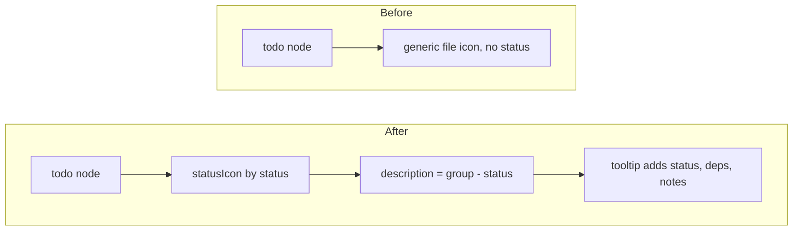

# TODO-002 Tree status icons

Group: standalone (edits only src/tree.ts)

## Brief

Goal: each TODO node shows a status icon+color and gray description text. Status becomes scannable without opening files.

Logic (before -> after):



How:

- Import `statusIcon` from [src/status.ts](src/status.ts).
- In `todoFileNodes`, set TODO node `iconPath = statusIcon(todo.status)` instead of `ThemeIcon("file")`.
- Set TODO node `description = ` group + status, e.g. `${todo.group} - ${todo.status}`. When group empty, use status only.
- Set TODO node `tooltip` to a `MarkdownString` or string with id, status, deps, notes.
- Leave outcome node icon as `output`. Do not change NEXT.md / CONTEXT.md / TODOS folder nodes.

Files:

- [src/tree.ts](src/tree.ts) (TODO node icon, description, tooltip)

Expected result:

- DONE todo shows green check; IN_PROGRESS shows spinning sync; BLOCKED shows red error; TODO shows gray circle outline.
- Each TODO node shows `group - status` in gray after the filename.
- Hover shows id, status, deps, notes.

Prompt:

```text
Edit src/tree.ts todoFileNodes only. Import statusIcon from ./status.ts. Set the TODO node iconPath to statusIcon(todo.status), description to group - status (status only when group empty), and a tooltip with id, status, deps, notes. Keep outcome node icon as output and leave all other nodes unchanged. Run impact analysis on todoFileNodes first. Then npm run compile.
```

## Verify

- `npm run compile` -> no type error.
- F5 dev host on this repo workspace -> TODO nodes show status-colored icons and `group - status` description.
- Hover a TODO node -> tooltip shows id, status, deps, notes.
