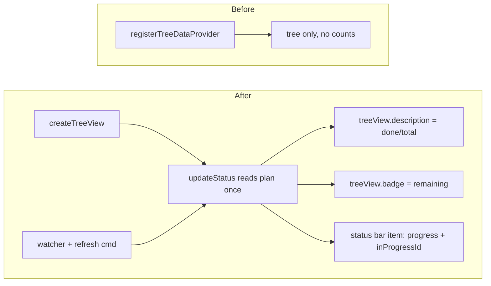

# TODO-003 Progress surfaces

Group: ext (edits src/extension.ts; ships with TODO-004)

## Brief

Goal: show plan progress outside the tree rows. View title shows done/total, activity-bar icon shows a remaining badge, and a status bar item shows progress and the current TODO.

Logic (before -> after):



How:

- Replace `registerTreeDataProvider("watchtower.tree", provider)` with `vscode.window.createTreeView("watchtower.tree", { treeDataProvider: provider })`; push the view to subscriptions.
- Add `summarize` import from [src/status.ts](src/status.ts).
- Add one `updateStatus()` that reads the plan once via [src/parser.ts](src/parser.ts) `readPlan(rootDir)`, then:
  - sets `treeView.description = ` `${done}/${total}` when a plan exists, else clears it.
  - sets `treeView.badge = remaining > 0 ? { value: remaining, tooltip } : undefined`.
  - updates a left-aligned `StatusBarItem`: text `$(telescope) Watchtower ${done}/${total}`, append ` - ${inProgressId}` when set; tooltip `${done} of ${total} done`; `command = "workbench.view.extension.watchtower"`; show when plan exists, hide otherwise.
- Create the status bar item in `activate`, push to subscriptions.
- Call `updateStatus()` once in `activate`, and from the existing `refresh` command and the watcher change/create/delete handlers (alongside `provider.refresh()`).
- Keep provider read for the tree as-is; the extra plan read here is fine (small file).

Files:

- [src/extension.ts](src/extension.ts) (createTreeView, status bar item, updateStatus, wire watcher+refresh)

Expected result:

- Plan view title shows e.g. `3/8` next to "Plan".
- Activity-bar Watchtower icon shows a numeric badge equal to not-done count; gone when all done.
- Status bar shows `Watchtower 3/8` plus current TODO when one is IN_PROGRESS; clicking focuses the sidebar.
- Editing NEXT.md updates all three within the watcher refresh.

Prompt:

```text
Edit src/extension.ts. Run impact analysis on activate first. Switch to vscode.window.createTreeView for watchtower.tree. Add a left StatusBarItem and an updateStatus() that reads the plan via readPlan, then sets treeView.description (done/total), treeView.badge (remaining, undefined when 0), and the status bar text/tooltip/command/visibility per the Brief and watchtower/CONTEXT.md. Call updateStatus in activate, in the refresh command, and in each watcher handler. Push view and status bar item to subscriptions. Run npm run compile.
```

## Verify

- `npm run compile` -> no type error.
- F5 dev host -> Plan title shows done/total; activity-bar badge shows remaining; status bar shows `Watchtower <done>/<total>`.
- Click status bar item -> Watchtower sidebar gets focus.
- Edit a Tracker Status in NEXT.md and save -> title, badge, status bar update.
