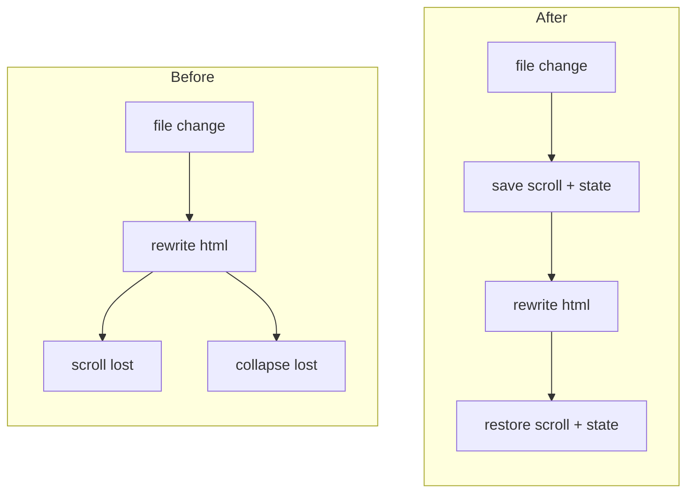

# TASK-002 Preserve scroll on refresh

Group: A (builds on TASK-001 debounce path)

## Brief

Goal: After any auto or manual refresh, restore the dashboard webview scroll position and any client-side toggle/collapse state so the view does not jump to top on every `watchtower/**` change.

Logic (before -> after):



How:

- In [media/dashboard.js](media/dashboard.js), before each re-render message arrives, store `window.scrollY` and collapse toggles via `vscode.setState`.
- Add a message from extension to webview (currently only `toast` flows this way, see [src/dashboardProvider.ts](src/dashboardProvider.ts) line 119) to signal post-refresh restore, or run restore on webview `load`.
- Simpler path: after `refresh()` rewrites html, client checks `vscode.getState()` on load and restores scroll and collapse. Confirm which by reading [media/dashboard.js](media/dashboard.js) first.

Files:

- [media/dashboard.js](media/dashboard.js) (save/restore scroll + collapse state)
- [src/dashboardProvider.ts](src/dashboardProvider.ts) (optional post-message if needed)

Expected result:

- Edit a todo spec while scrolled down -> dashboard refreshes, scroll stays at same position.
- Collapsed sections stay collapsed across an auto-refresh.

Prompt:

```text
Make dashboard auto-refresh non-disruptive. Read media/dashboard.js and src/dashboardProvider.ts first. Current refresh() rewrites webview.html wholesale at dashboardProvider.ts line 22, wiping scroll and client state. In media/dashboard.js, persist window.scrollY and any collapse/toggle state in vscode.getState() before refresh, and restore it after the re-rendered document loads. If needed, extend the extension-to-webview message channel (currently only toast) at dashboardProvider.ts line 119 with a restore signal. Keep TASK-001 debounce path as the trigger. No second watcher.
```

## Verify

- Open dashboard, scroll to bottom, save watchtower/NEXT.md -> scroll stays at bottom after refresh.
- Collapse a section, trigger refresh -> section stays collapsed.
- Manual refresh command preserves state too.
