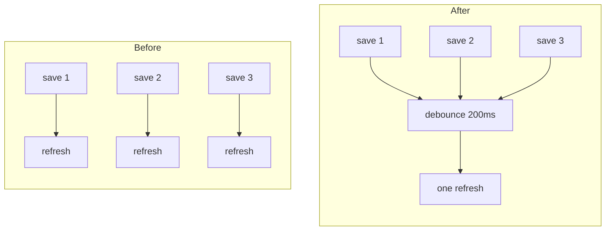

# TODO-001 Debounce watcher fires

Group: A (pairs with TODO-002; both make refresh smooth on file change)

## Brief

Goal: Coalesce rapid `watchtower/**` file events into one refresh so multi-save bursts no longer re-render the dashboard per event.

Logic (before -> after):



How:

- Add private debounce timer field on `WatchtowerDashboardProvider`.
- Add method `refreshDebounced(delayMs = 200)` that clears an existing timer then schedules `refresh` plus status callback.
- In [src/extension.ts](src/extension.ts) lines 105-108, replace direct `provider.refresh()` + `updateStatus()` inside `onPlanChange` with `provider.refreshDebounced()`. Keep `watchtower.refresh` command (manual) immediate, not debounced.

Files:

- [src/dashboardProvider.ts](src/dashboardProvider.ts) (add debounce timer + `refreshDebounced`)
- [src/extension.ts](src/extension.ts) (route watcher events through `refreshDebounced`)

Expected result:

- Several saves within 200ms produce exactly one HTML rewrite.
- Manual Refresh command still refreshes immediately.

Prompt:

```text
Add a debounce path for the existing watchtower file watcher. In src/dashboardProvider.ts add a private NodeJS.Timeout/number timer field and a refreshDebounced(delayMs = 200) method on WatchtowerDashboardProvider that clears any pending timer then schedules refresh() plus a supplied status callback. Keep refresh() immediate. In src/extension.ts change the onPlanChange handler at lines 105-108 to call provider.refreshDebounced() instead of inline provider.refresh() + updateStatus(); pass updateStatus as the callback. Leave the watchtower.refresh command calling refresh() + updateStatus() directly. Do not add a second watcher.
```

## Verify

- Save watchtower/NEXT.md five times within 200ms with dashboard open -> observe one refresh, not five.
- Run command "Watchtower: Refresh Plan" -> dashboard updates immediately, no delay.
- `node .gitnexus/run.cjs analyze` or `npx tsc --noEmit` if present -> no type errors.
