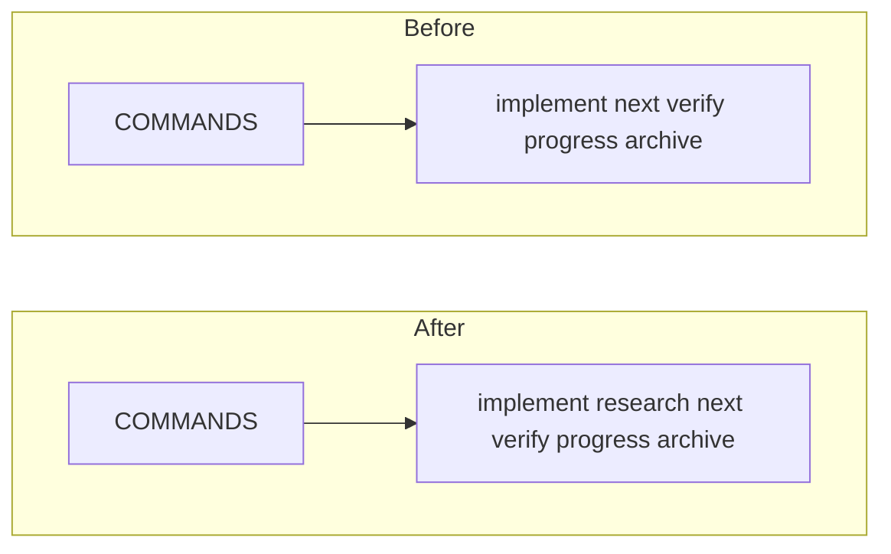

# TASK-001 Add Research Command

Group: commands (same dashboard command surface)

## Brief

Goal: Add `research` to Watchtower command copy UI. Codex and Claude both expose command.

Logic (before -> after):



How:

- Add `research` command entry near `next` in [src/dashboardHtml.ts](src/dashboardHtml.ts).
- Ensure command text becomes `$watchtower research\n` and `/watchtower research\n`.
- Update tests in [test/dashboardHtml.test.ts](test/dashboardHtml.test.ts).

Files:

- [src/dashboardHtml.ts](src/dashboardHtml.ts) (command list includes research)
- [test/dashboardHtml.test.ts](test/dashboardHtml.test.ts) (assert research commands render)

Expected result:

- Active dashboard command bar shows `research` for Codex and Claude.
- Copy data includes `$watchtower research\n` and `/watchtower research\n`.

Prompt:

```text
Use /solve. Add Watchtower research command to dashboard command copy UI. Read src/dashboardHtml.ts and test/dashboardHtml.test.ts first. Keep change scoped. Run GitNexus impact before editing any symbol. Update tests for both Codex and Claude command text.
```

## Verify

- `npm test -- --test-name-pattern "copy buttons carry Codex and Claude watchtower commands"` -> test passes and asserts research copy text.
- `npm test` -> all tests pass.
