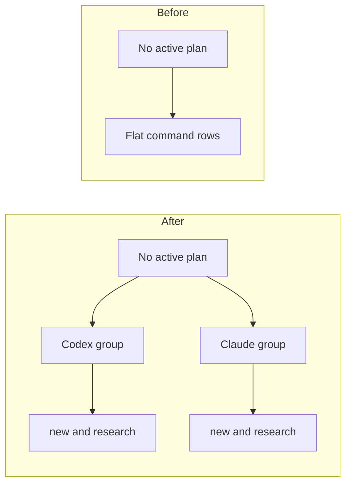

# TASK-002 Group Empty Commands By Agent

Group: commands (same dashboard command surface)

## Brief

Goal: Rework no-plan command UI into two clear groups: Codex and Claude. Each group exposes `new` and `research`.

Logic (before -> after):



How:

- Refactor empty state command rendering in [src/dashboardHtml.ts](src/dashboardHtml.ts).
- Reuse agent labels and prefixes where possible.
- Keep copy behavior and accessible button labels.
- Update [media/dashboard.css](media/dashboard.css) so groups stay compact in narrow sidebar.
- Update [test/dashboardHtml.test.ts](test/dashboardHtml.test.ts) for no-plan command groups.

Files:

- [src/dashboardHtml.ts](src/dashboardHtml.ts) (empty state command markup)
- [media/dashboard.css](media/dashboard.css) (empty state grouped command layout)
- [test/dashboardHtml.test.ts](test/dashboardHtml.test.ts) (empty state assertions)

Expected result:

- No-plan state shows Codex group and Claude group.
- Each group has `new` and `research` command buttons.
- Existing copy icon/style stays readable and no text overlaps in sidebar width.

Prompt:

```text
Use /solve. Group the empty no-plan Watchtower commands into Codex and Claude sections. Include new and research in each group. Read src/dashboardHtml.ts, media/dashboard.css, and test/dashboardHtml.test.ts first. Run GitNexus impact before editing symbols. Keep active-plan command bar behavior intact except TASK-001 research command.
```

## Verify

- `npm test -- --test-name-pattern "null plan shows empty state"` -> test passes and asserts Codex and Claude grouped no-plan commands.
- `npm test` -> all tests pass.
- Manual VS Code check -> no active plan panel shows two agent groups without clipped command text.
