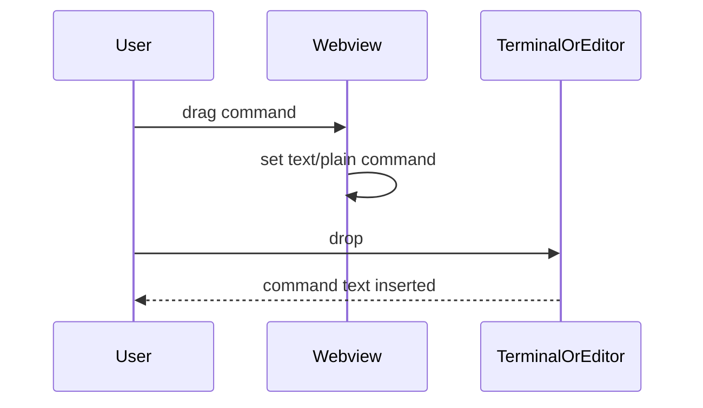

# TASK-003 Drag Commands As Text

Group: commands (same dashboard command surface)

## Brief

Goal: Let user drag any command button into VS Code terminal or editor. Dropped text should match copy command text.

Logic (before -> after):



How:

- Add `draggable="true"` and command text data to command buttons in [src/dashboardHtml.ts](src/dashboardHtml.ts).
- Add dragstart handling in [media/dashboard.js](media/dashboard.js).
- Set `text/plain` to same text used by copy.
- Keep click, keyboard, and menu behavior unchanged.
- Add tests in [test/dashboardHtml.test.ts](test/dashboardHtml.test.ts) for draggable command markup.

Files:

- [src/dashboardHtml.ts](src/dashboardHtml.ts) (draggable command attributes)
- [media/dashboard.js](media/dashboard.js) (drag payload handling)
- [media/dashboard.css](media/dashboard.css) (optional drag cursor/focus polish)
- [test/dashboardHtml.test.ts](test/dashboardHtml.test.ts) (drag markup tests)

Expected result:

- Command buttons can be dragged.
- Drop into VS Code terminal or editor inserts same command text as copy.
- Click copy still writes same command to clipboard.

Prompt:

```text
Use /solve. Add drag-and-drop command text support to Watchtower dashboard commands. Read src/dashboardHtml.ts, media/dashboard.js, media/dashboard.css, and test/dashboardHtml.test.ts first. Run GitNexus impact before editing symbols. Set text/plain drag payload from data-text. Preserve click copy and keyboard activation.
```

## Verify

- `npm test` -> all tests pass, including draggable command markup tests.
- Manual VS Code check -> drag `$watchtower research` into terminal/editor inserts command text.
- Manual VS Code check -> click copy still shows copied toast.
