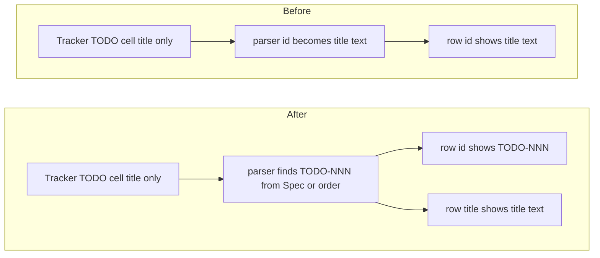

# TODO-004 Show TODO Code In Rows

Group: commands (same dashboard row surface)

## Brief

Goal: TODO row id column always shows canonical `TODO-NNN`. If Tracker TODO cell holds title text, derive code from Spec filename or order.

Logic (before -> after):



How:

- Read parser row split logic in [src/parser.ts](src/parser.ts).
- Find why non-`TODO-NNN` TODO cells become `todo.id`.
- Prefer `TODO-NNN` from Spec basename when present.
- Fall back to `TODO-<Order padded to 3>` only when Spec has no code.
- Keep real title text in `todo.title`.
- Update parser tests in [test/parser.test.ts](test/parser.test.ts).
- Add/adjust dashboard tests in [test/dashboardHtml.test.ts](test/dashboardHtml.test.ts) if row markup needs proof.

Files:

- [src/parser.ts](src/parser.ts) (derive canonical TODO id and title)
- [test/parser.test.ts](test/parser.test.ts) (title-only Tracker TODO cell regression)
- [test/dashboardHtml.test.ts](test/dashboardHtml.test.ts) (row renders code in id column when useful)

Expected result:

- Screenshot case shows `TODO-NNN` in first column, not title text.
- Row title column still shows readable task title.
- Implement copy menu uses `$watchtower implement TODO-NNN`.

Prompt:

```text
Use /solve. Fix Watchtower dashboard rows so TODO id column always shows canonical TODO-NNN, even when Tracker TODO cell is title text. Read src/parser.ts, src/dashboardHtml.ts, test/parser.test.ts, and test/dashboardHtml.test.ts first. Run GitNexus impact before editing parseTracker or todoRow. Prefer TODO code from Spec basename, then padded Order fallback. Preserve title text in todo.title and keep copy commands using TODO-NNN.
```

## Verify

- `npm test -- --test-name-pattern "parsePlanContent derives todo id from Spec when TODO cell is title only"` -> test passes.
- `npm test` -> all tests pass.
- Manual VS Code check -> TODO section id column shows `TODO-NNN`, title column shows task text, copy menu command uses `TODO-NNN`.
