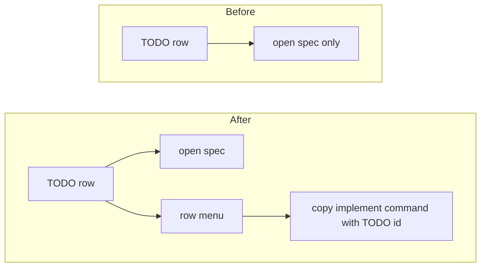

# TODO-001 Add Row Implement Copy Menu

Group: standalone

## Brief

Goal: TODO row menu gets command copy item. User can copy row-specific `watchtower implement TODO-NNN` command from each TODO row.

Logic (before -> after):



How:

- Run GitNexus impact before editing changed symbols: `todoRow` first, then any helper touched.
- Add row action menu or compact row menu button in [src/dashboardHtml.ts](src/dashboardHtml.ts).
- Keep default row click opening TODO spec.
- Copy `$watchtower implement TODO-NNN\n` for Codex.
- If adding Claude parity, copy `/watchtower implement TODO-NNN\n`.
- Prevent menu click from opening spec in [media/dashboard.js](media/dashboard.js).
- Add small styles in [media/dashboard.css](media/dashboard.css) so row text stays stable.
- Add tests in [test/dashboardHtml.test.ts](test/dashboardHtml.test.ts) for data text and escaping.

Files:

- [src/dashboardHtml.ts](src/dashboardHtml.ts) (render row menu item and escaped row command text)
- [media/dashboard.js](media/dashboard.js) (keep copy click from bubbling into row open)
- [media/dashboard.css](media/dashboard.css) (style row menu action without layout jump)
- [test/dashboardHtml.test.ts](test/dashboardHtml.test.ts) (prove row command exists for each TODO id)

Expected result:

- Each TODO row exposes menu item that copies `$watchtower implement TODO-NNN`.
- Copy click does not open TODO spec.
- Existing row click still opens TODO spec.
- Existing global command buttons keep current behavior.

Prompt:

```text
Use /solve. Implement TODO-001 only. In Watchtower dashboard TODO rows, add row menu item that copies row-specific implement command. Command text must include TODO id, for example `$watchtower implement TODO-001\n`. Keep row click opening spec. Stop copy/menu clicks from opening spec. Add tests in test/dashboardHtml.test.ts. Run npm test, npm run compile, then bash scripts/build-and-install.sh because src/media files change.
```

## Verify

- npm test -> all tests pass, including row implement copy command coverage.
- npm run compile -> TypeScript and bundle compile pass.
- bash scripts/build-and-install.sh -> VSIX builds and installs into VS Code.
